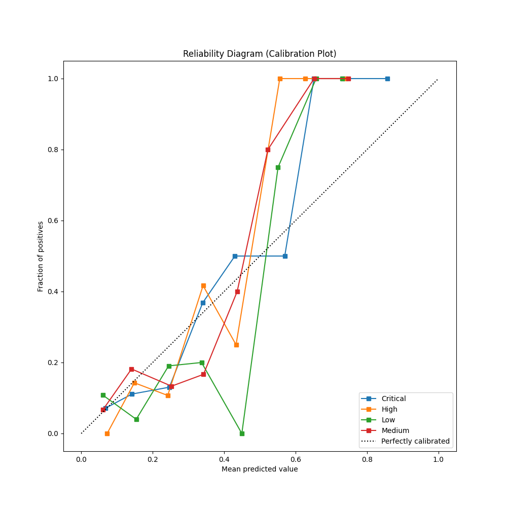
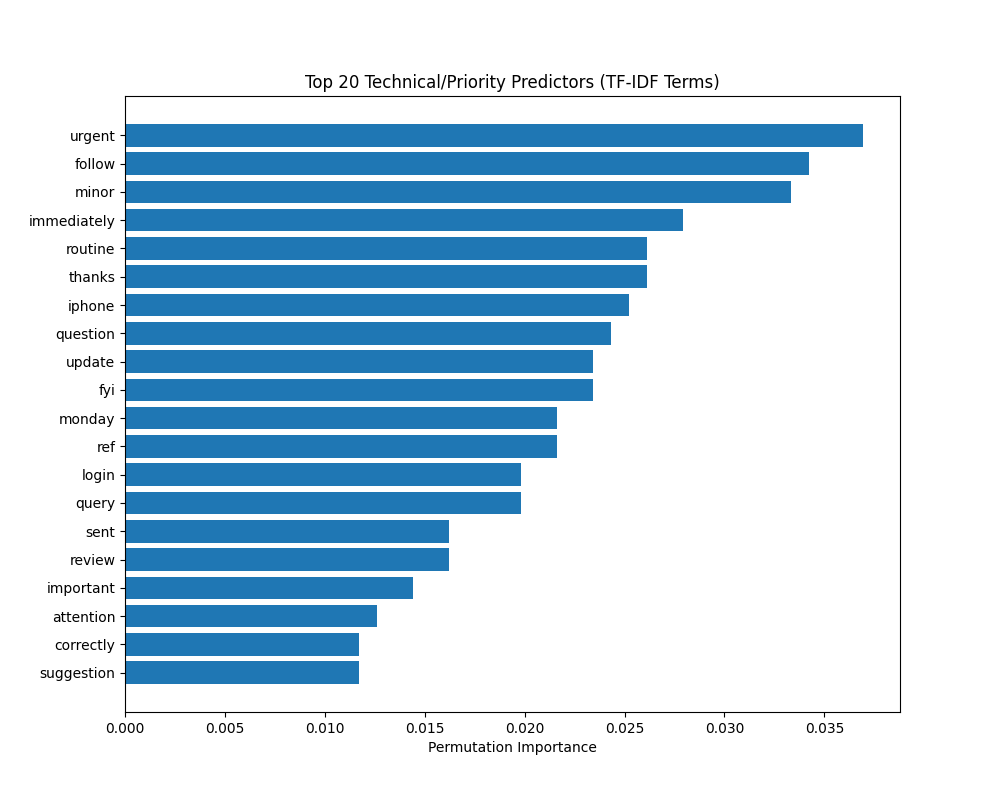
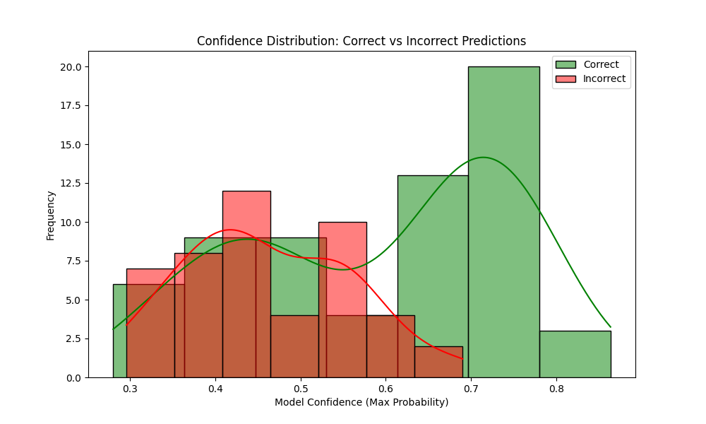

# AI Ticket Triage System 🎓
[ **Institutional Grade ML Research Project** ]

An automated customer support triage system using hardened classical ML pipelines (SVM + Naive Bayes) with a full observability stack .

## 🌐 Live System
[🔥 Interactive Research Dashboard](http://localhost:8501) | [📚 API Documentation](http://localhost:8000/docs)

---

## 🔬 Research Gallery (Visual Walkthrough)

### 1. Model Calibration & Reliability
*Visualizing how well the model's confidence scores align with actual accuracy.*


### 2. Feature Importance (TF-IDF Coeffs)
*The most influential terms driving classification decisions.*


### 3. Error Analysis: Confidence Distribution
*Distribution of confidence scores for correct vs incorrect predictions.*


---

## 📈 Research Highlights
| Task | Result | Best Model | Baseline Lift |
| :--- | :--- | :--- | :--- |
| **Category Classification** | **96.5% F1** | Naive Bayes | **2.9x** over Majority |
| **Priority Prediction** | **51.6% F1** | SVM (Linear) | **2.1x** over Random |

## 🔬 Core Findings
✅ **Ablation Study**: Unigram + Linear SVM identified as optimal pipeline for support-domain semantic triage.
✅ **Statistical Rigor**: 95% Confidence Interval for Accuracy: **[47.8%, 66.7%]** (via 1000-iteration bootstrap).
✅ **Error Taxonomy**: 75% of misclassifications linked to **OOV Jargon** and **Semantic Negation Context Loss**.

---

## 🚀 Deployment (1-Click)
```bash
docker-compose up --build
```
*This starts the FastAPI backend (8000) and Streamlit Research Dashboard (8501).*

## 🛠️ Technical Stack
- **Core**: Python 3.10, Scikit-Learn Pipelines
- **Observability**: SQLite, Streamlit, Plotly
- **API**: FastAPI + Pydantic (w/ Alias support)
- **Containerization**: Docker & Docker Compose

---

## Usage
**Predict Functionality**:
Send a POST request to `/predict` with a JSON body:
```json
{
  "text": "My payment failed and I was charged twice."
}
```
*Note: The API also supports the legacy `description` field for backward compatibility.*

---

## Constraints & Notes
- This system uses optimized classical models for efficiency and interpretability.
- Deep Learning (BERT, etc.) is included as a comparative benchmark but classical models are prioritized for production stability.
- No production deployment is claimed.
