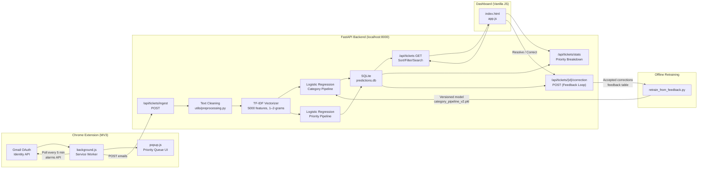

# System Architecture

## Mermaid Diagram (embed in paper)



## Component Descriptions

| Component | Technology | Role |
|---|---|---|
| Chrome Extension | JavaScript MV3 | Reads Gmail via OAuth, pushes to backend |
| FastAPI Backend | Python 3.10, Uvicorn | REST API, ML inference, SQLite management |
| ML Pipeline | scikit-learn 1.5 | TF-IDF + Logistic Regression (Category & Priority) |
| SQLite | `predictions.db` | Tickets, config, feedback, prediction logs |
| Dashboard | Vanilla JS + CSS | Ticket queue, stats, resolve/correct UI |
| Feedback Loop | Python script | Retrains model from agent corrections (novel) |

## Data Flow (End-to-End)

```
[Gmail Inbox]
      │  OAuth (gmail.readonly)
      ▼
[background.js] ──── POST /api/tickets/ingest ────▶ [FastAPI]
                                                         │
                                              clean_text() 
                                                         │
                                              TF-IDF transform
                                                         │
                                         ┌───────────────┴──────────────┐
                                         ▼                              ▼
                                 Category LR                      Priority LR
                                 (Account/Billing/Tech)           (Low→Critical)
                                         │                              │
                                         └──────────── SQLite ──────────┘
                                                           │
                                               ┌───────────┴───────────┐
                                               ▼                       ▼
                                       Dashboard UI              Chrome popup
                                    (sort, filter, resolve)    (priority queue)
                                               │
                                   Agent corrects label ✏️
                                               │
                                         feedback table
                                               │
                                    retrain_from_feedback.py
                                               │
                                    category_pipeline_v2.pkl
```
